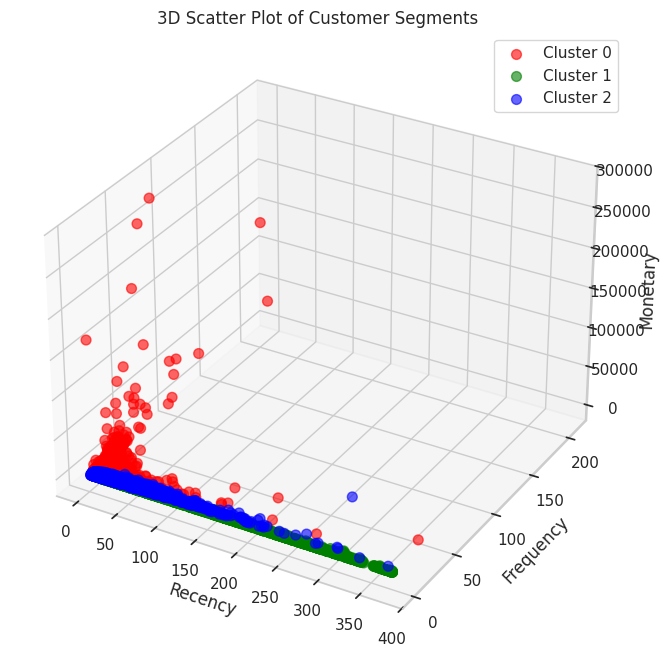
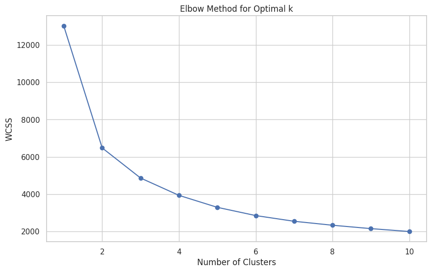

# Customer Segmentation using RFM Analysis & K-Means Clustering

## 📌 Project Overview
This project focuses on segmenting the customers of an online retail store to understand their buying behavior. By identifying different customer groups, businesses can create targeted marketing strategies to improve customer retention and sales.

## 📊 Methodology
I used the **RFM (Recency, Frequency, Monetary)** model combined with **K-Means Clustering** to segment the customers.

### 1. Data Preprocessing
- Used the **UCI Online Retail Dataset**.
- Cleaned missing values and filtered out negative transactions (returns).
- Created a `TotalAmount` feature (`Quantity * UnitPrice`).

### 2. Feature Engineering (RFM)
- **Recency (R):** Days since the last purchase.
- **Frequency (F):** Total number of transactions.
- **Monetary (M):** Total money spent by the customer.

### 3. Modeling
- Applied **Log Transformation** to normalize the skewed data.
- Standardized the data using `StandardScaler`.
- Used the **Elbow Method** to determine the optimal number of clusters (k=3).
- Applied **K-Means Clustering** Algorithm.

## 📈 Key Findings (Clusters)
The customers were divided into 3 distinct segments:

| Cluster | Customer Type | Characteristics | Strategy Recommendation |
| :--- | :--- | :--- | :--- |
| **0** | **Loyal Customers** | Moderate spending, frequent visits. | Upselling & Loyalty Programs. |
| **1** | **At-Risk / Low Value** | Haven't visited in a long time, low spending. | Discount Coupons to bring them back. |
| **2** | **Big Spenders (VIP)** | High spending, very frequent, recent buyers. | Premium Service & Exclusive Access. |

## 🛠️ Tech Stack
- **Python** (Pandas, NumPy)
- **Machine Learning** (Scikit-Learn, K-Means)
- **Visualization** (Matplotlib, Seaborn)

## 📷 Results

*Author: [Auchitya singh]*